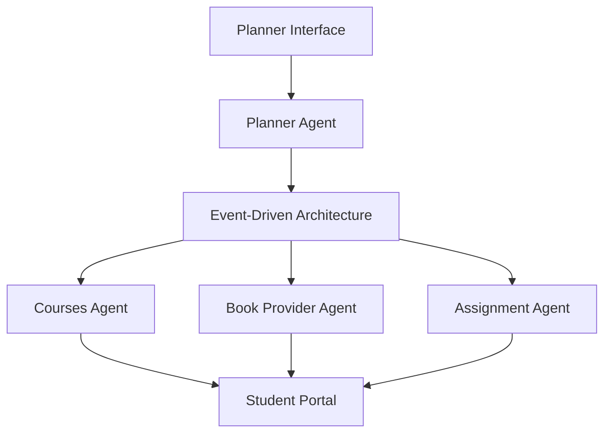
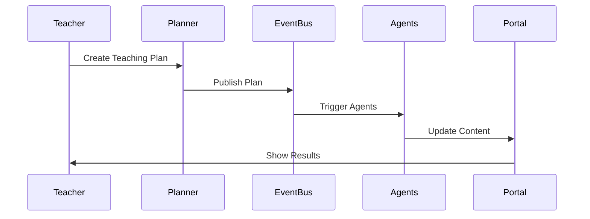

# AiDemy Architecture Documentation

This document describes the architecture of the AiDemy educational platform, which is based on the Google Codelab "Building Multi-Agent Systems with LangGraph, EDA, and Generative AI on Google Cloud" with additional improvements and enhancements.

## System Overview

AiDemy is an AI-powered teaching assistant designed to help educators manage their workload and provide better support to students. The system consists of two main interfaces:
1. A planner interface for teachers to create lesson plans
2. A portal interface for students to access quizzes, audio recaps, and assignments

## Architecture Diagram

## Key Components

### 1. Google Cloud Platform (GCP) Services
- **Vertex AI**: Powers the Gemini LLMs
- **Cloud Run**: Hosts containerized agents and functions
- **Cloud SQL**: PostgreSQL database for curriculum data
- **Pub/Sub & Eventarc**: Enables event-driven architecture
- **Cloud Storage**: Stores audio recaps and assignment files
- **Secret Manager**: Manages database credentials
- **Artifact Registry**: Stores Docker images
- **Compute Engine**: Hosts self-hosted LLMs

### 2. LLM Integration
- **Gemini Models**:
  - Gemini 1.0 Pro
  - Gemini 2 Flash
  - Gemini 2 Flash Thinking
  - Gemini 1.5-pro
- **DeepSeek**: Specialized for self-study assignments
- **Ollama**: Self-hosted LLM alternative

### 3. Framework Integration
- **LangChain & LangGraph**: Orchestrates multi-agent workflows
- **Event-Driven Architecture**: Enables scalable communication

## Event Flow

## Improvements Over Original

This enhanced version includes:
1. Improved documentation and code organization
2. Added testing infrastructure
3. Enhanced configuration management
4. Better development workflow
5. Additional security measures
6. Performance optimizations

## Security Considerations

- All sensitive data is stored in Secret Manager
- Service accounts have minimal required permissions
- API endpoints are protected
- Input validation on all endpoints
- Rate limiting implemented

## Performance Optimization

- Caching mechanisms for frequently accessed data
- Optimized database queries
- Efficient event handling
- Resource scaling based on demand

## Monitoring and Logging

- Centralized logging system
- Performance metrics collection
- Error tracking and alerting
- Usage analytics

## Future Enhancements

1. Real-time Q&A using Gemini 2's Live API
2. Automated assignment submission and grading
3. Plagiarism detection using RAG
4. Enhanced personalization features
5. Additional language support 